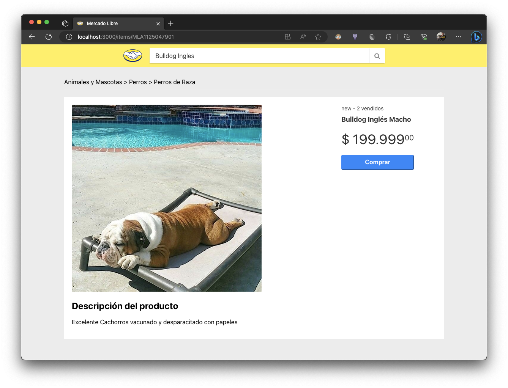

# MELI React Front-End

Este proyecto permite realizar busquedas de productos desde [Mercadolibre](http://www.mercadolibre.com.ar)
y ver el detalle de estos.

## Como ejecutar

En el directorio dle proyecto debes ejecutar:

### `npm start`

Ejecuta la aplicación para poder probar desde tu navegar en la siguiente url [http://localhost:3000](http://localhost:3000) 

**Nota: Es requisito tener arriba el servidor node con el proyecto [BFF](https://github.com/ramonchop/meli_bff)**

## Que podemos realizar

Se puede realizar la busqueda de productos desde el buscador

Por ejemplo quiero buscar un **Bulldog Ingles**, y la web me muestra los resultados de la busqueda.

Por último si quiero ver el detalle de algún Bulldog, solo debo seleccionarlo y me mostrará el detalle de este.

